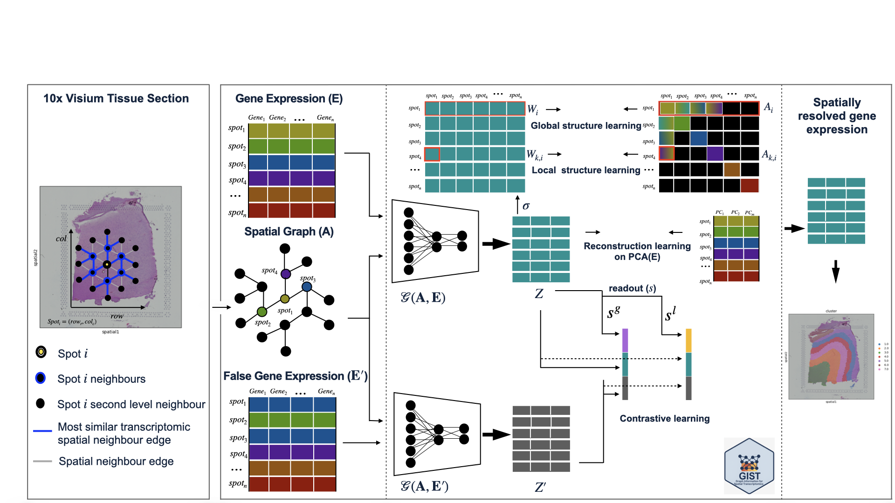

# GIST
Leveraging Graph Information for Spatially Informed Patient Data Analysis with GIST



install GIST packages
````
pip install git+https://github.com/gospelnnadi/GIST.git

````

Create an environment if necessary
````
conda create -n gist  -y
conda activate gist
conda install  -c conda-forge python==3.10.0 r-base==4.3.1 rpy2=3.5.11  pip -y

pip install torch==2.1.0 

pip install torch_sparse -f https://data.pyg.org/whl/torch-2.1.0+cu121.html
pip install torch_scatter -f https://data.pyg.org/whl/torch-2.1.0+cu121.html
pip install torch_cluster -f https://data.pyg.org/whl/torch-2.1.0+cu121.html
pip install torch_spline_conv -f https://data.pyg.org/whl/torch-2.1.0+cu121.html

pip install torch-geometric==2.7.0 torchaudio==2.1.0 torchvision==0.16.0 
pip install -r requirements.txt

Rscript -e 'install.packages("remotes", repos="https://cran.r-project.org")'

Rscript -e 'remotes::install_version("mclust", version = "6.0.1", repos="https://cran.r-project.org")'

````
Verify R home is in the conda environment 
````
which R

````
/home/youruser/anaconda3/envs/gist/lib/R


run_GIST.py  contains the GIST pipeline. 
````
python run_GIST.py &> output.log
````

### Data Availability ###
The spatial transcriptomics datasets are available at:  https://doi.org/10.5281/zenodo.15277298

Download the DLPFC 151673 data:
````
        wget https://zenodo.org/records/19056154/files/Data.zip
        unzip Data.zip
        rm Data.zip
````
### Reference

G. O. Nnadi, V. Bonnici, S. Avesani, E. Viesi and R. Giugno, "Leveraging Graph Information for Spatially Informed Patient Data Analysis with GIST," 2025 IEEE Conference on Computational Intelligence in Bioinformatics and Computational Biology (CIBCB), Tainan, Taiwan, 2025, pp. 1-8, doi: 10.1109/CIBCB66090.2025.11177089. keywords: {Measurement;Computational modeling;Transcriptomics;Computer architecture;Contrastive learning;Brain modeling;Spatial databases;Graph neural networks;Indexes;Gene expression;Domain identification;Graph representation;Spatial transcriptomics}.


### Information on the conda installation.
To ensure reproducibilty and easier setup we provide the conda quick installation

#### Install Miniconda
   ````
      mkdir -p ~/miniconda3
      wget https://repo.anaconda.com/miniconda/Miniconda3-latest-Linux-x86_64.sh -O ~/miniconda3/miniconda.sh
      bash ~/miniconda3/miniconda.sh -b -u -p ~/miniconda3
      rm ~/miniconda3/miniconda.sh
   ````

Make conda available
````
source ~/miniconda3/bin/activate
````

Verify conda installation
```` 
conda --version
```` 

#### Initialize conda

````
 conda init --all
 conda tos accept --override-channels --channel https://repo.anaconda.com/pkgs/main
 conda tos accept --override-channels --channel https://repo.anaconda.com/pkgs/r
 conda config --add channels conda-forge
````

